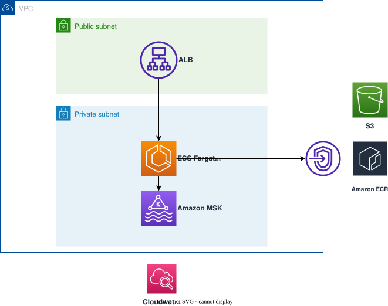

# Amazon MSK with AKHQ UI

Terraform sample of [Amazon MSK](https://aws.amazon.com/fr/msk/) with [AKHQ UI](https://akhq.io).

#### Overview



## Getting started

Copy akhq docker image to ECR private repository (you could also use public ECR)
```bash
aws ecr get-login-password --region eu-west-3 | docker login --username AWS --password-stdin **********.dkr.ecr.eu-west-3.amazonaws.com

aws ecr create-repository --repository-name kafka/akhq

crane cp tchiotludo/akhq:latest **********.dkr.ecr.eu-west-3.amazonaws.com/kafka/akhq:latest
```

Run terraform
```bash
terraform init
terraform apply -auto-approve
...
Apply complete! Resources: 77 added, 0 changed, 0 destroyed.

Outputs:

alb_hostname = "lb-185880044.eu-west-3.elb.amazonaws.com:8080"
msk_bootstrap = tolist([
  "b-1.labmskakhq.q0catq.c2.kafka.eu-west-3.amazonaws.com:9098,b-2.labmskakhq.q0catq.c2.kafka.eu-west-3.amazonaws.com:9098,b-3.labmskakhq.q0catq.c2.kafka.eu-west-3.amazonaws.com:9098",
])
msk_bootstrap_iam = "b-1.labmskakhq.q0catq.c2.kafka.eu-west-3.amazonaws.com:9098,b-2.labmskakhq.q0catq.c2.kafka.eu-west-3.amazonaws.com:9098,b-3.labmskakhq.q0catq.c2.kafka.eu-west-3.amazonaws.com:9098"
```

Akhq ui is available at http://lb-185880044.eu-west-3.elb.amazonaws.com:8080

<!-- BEGIN_TF_DOCS -->
## Requirements

| Name | Version |
|------|---------|
| <a name="requirement_terraform"></a> [terraform](#requirement\_terraform) | >= 1.9.0 |
| <a name="requirement_aws"></a> [aws](#requirement\_aws) | ~> 5.4 |

## Providers

| Name | Version |
|------|---------|
| <a name="provider_aws"></a> [aws](#provider\_aws) | 5.49.0 |
| <a name="provider_terraform"></a> [terraform](#provider\_terraform) | n/a |

## Modules

| Name | Source | Version |
|------|--------|---------|
| <a name="module_msk_cluster"></a> [msk\_cluster](#module\_msk\_cluster) | terraform-aws-modules/msk-kafka-cluster/aws | 2.5.0 |
| <a name="module_security_group"></a> [security\_group](#module\_security\_group) | terraform-aws-modules/security-group/aws | ~> 5.0 |

## Resources

| Name | Type |
|------|------|
| [aws_alb.main](https://registry.terraform.io/providers/hashicorp/aws/latest/docs/resources/alb) | resource |
| [aws_alb_listener.front_end](https://registry.terraform.io/providers/hashicorp/aws/latest/docs/resources/alb_listener) | resource |
| [aws_alb_target_group.app](https://registry.terraform.io/providers/hashicorp/aws/latest/docs/resources/alb_target_group) | resource |
| [aws_appautoscaling_policy.down](https://registry.terraform.io/providers/hashicorp/aws/latest/docs/resources/appautoscaling_policy) | resource |
| [aws_appautoscaling_policy.up](https://registry.terraform.io/providers/hashicorp/aws/latest/docs/resources/appautoscaling_policy) | resource |
| [aws_appautoscaling_target.target](https://registry.terraform.io/providers/hashicorp/aws/latest/docs/resources/appautoscaling_target) | resource |
| [aws_cloudwatch_log_group.ecs_log](https://registry.terraform.io/providers/hashicorp/aws/latest/docs/resources/cloudwatch_log_group) | resource |
| [aws_ecs_cluster.app](https://registry.terraform.io/providers/hashicorp/aws/latest/docs/resources/ecs_cluster) | resource |
| [aws_ecs_service.ecs_service](https://registry.terraform.io/providers/hashicorp/aws/latest/docs/resources/ecs_service) | resource |
| [aws_ecs_task_definition.ecs_task_app](https://registry.terraform.io/providers/hashicorp/aws/latest/docs/resources/ecs_task_definition) | resource |
| [aws_iam_role.ecs_auto_scale_role](https://registry.terraform.io/providers/hashicorp/aws/latest/docs/resources/iam_role) | resource |
| [aws_iam_role.task_execution_role](https://registry.terraform.io/providers/hashicorp/aws/latest/docs/resources/iam_role) | resource |
| [aws_iam_role.task_role](https://registry.terraform.io/providers/hashicorp/aws/latest/docs/resources/iam_role) | resource |
| [aws_iam_role_policy_attachment.ecs_auto_scale_role](https://registry.terraform.io/providers/hashicorp/aws/latest/docs/resources/iam_role_policy_attachment) | resource |
| [aws_iam_role_policy_attachment.ecs_task_execution_role](https://registry.terraform.io/providers/hashicorp/aws/latest/docs/resources/iam_role_policy_attachment) | resource |
| [aws_iam_role_policy_attachment.ecs_task_role](https://registry.terraform.io/providers/hashicorp/aws/latest/docs/resources/iam_role_policy_attachment) | resource |
| [aws_security_group.ecs_tasks](https://registry.terraform.io/providers/hashicorp/aws/latest/docs/resources/security_group) | resource |
| [aws_security_group.lb](https://registry.terraform.io/providers/hashicorp/aws/latest/docs/resources/security_group) | resource |
| [aws_caller_identity.current](https://registry.terraform.io/providers/hashicorp/aws/latest/docs/data-sources/caller_identity) | data source |
| [aws_iam_policy.ecs_task_execution_role](https://registry.terraform.io/providers/hashicorp/aws/latest/docs/data-sources/iam_policy) | data source |
| [aws_iam_policy_document.ecs_auto_scale_role](https://registry.terraform.io/providers/hashicorp/aws/latest/docs/data-sources/iam_policy_document) | data source |
| [aws_iam_policy_document.ecs_task_assume_role](https://registry.terraform.io/providers/hashicorp/aws/latest/docs/data-sources/iam_policy_document) | data source |
| [aws_iam_policy_document.ecs_task_msk_policy](https://registry.terraform.io/providers/hashicorp/aws/latest/docs/data-sources/iam_policy_document) | data source |
| [aws_iam_policy_document.ecs_task_policy](https://registry.terraform.io/providers/hashicorp/aws/latest/docs/data-sources/iam_policy_document) | data source |
| [terraform_remote_state.vpc](https://registry.terraform.io/providers/hashicorp/terraform/latest/docs/data-sources/remote_state) | data source |

## Inputs

| Name | Description | Type | Default | Required |
|------|-------------|------|---------|:--------:|
| <a name="input_aws_profile"></a> [aws\_profile](#input\_aws\_profile) | AWS profile | `string` | `"default"` | no |
| <a name="input_aws_region"></a> [aws\_region](#input\_aws\_region) | AWS target region | `string` | `"eu-west-3"` | no |

## Outputs

| Name | Description |
|------|-------------|
| <a name="output_alb_hostname"></a> [alb\_hostname](#output\_alb\_hostname) | ALB hostname |
| <a name="output_msk_bootstrap"></a> [msk\_bootstrap](#output\_msk\_bootstrap) | MSK bootstrap brokers |
| <a name="output_msk_bootstrap_iam"></a> [msk\_bootstrap\_iam](#output\_msk\_bootstrap\_iam) | MSK bootstrap brokers SASL IAM |
<!-- END_TF_DOCS -->