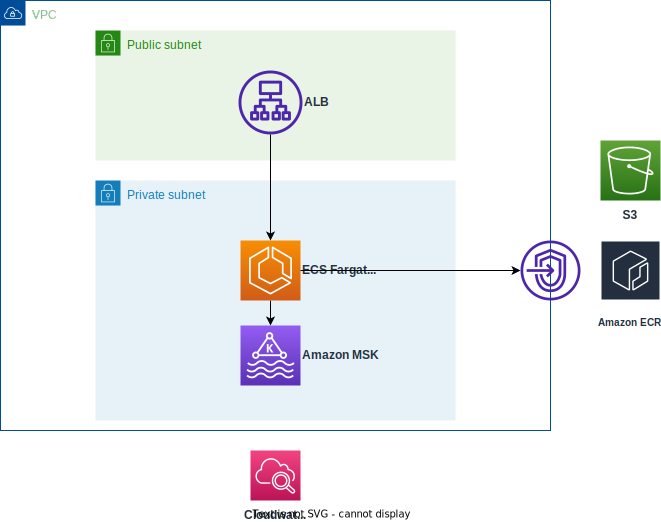

# Amazon MSK with AKHQ UI

Terraform sample of [Amazon MSK](https://aws.amazon.com/fr/msk/) with [AKHQ UI](https://akhq.io).

#### Overview



## Getting started

Copy akhq docker image to ECR private repository (you could also use public ECR)
```bash
aws ecr get-login-password --region eu-west-3 | docker login --username AWS --password-stdin **********.dkr.ecr.eu-west-3.amazonaws.com

aws ecr create-repository --repository-name kafka/akhq

crane cp tchiotludo/akhq:latest **********.dkr.ecr.eu-west-3.amazonaws.com/kafka/akhq:latest
```

Run terraform
```bash
terraform init
terraform apply -auto-approve
...
Apply complete! Resources: 77 added, 0 changed, 0 destroyed.

Outputs:

alb_hostname = "lb-185880044.eu-west-3.elb.amazonaws.com:8080"
msk_bootstrap = tolist([
  "b-1.labmskakhq.q0catq.c2.kafka.eu-west-3.amazonaws.com:9098,b-2.labmskakhq.q0catq.c2.kafka.eu-west-3.amazonaws.com:9098,b-3.labmskakhq.q0catq.c2.kafka.eu-west-3.amazonaws.com:9098",
])
msk_bootstrap_iam = "b-1.labmskakhq.q0catq.c2.kafka.eu-west-3.amazonaws.com:9098,b-2.labmskakhq.q0catq.c2.kafka.eu-west-3.amazonaws.com:9098,b-3.labmskakhq.q0catq.c2.kafka.eu-west-3.amazonaws.com:9098"
```

Akhq ui is available at http://lb-185880044.eu-west-3.elb.amazonaws.com:8080
